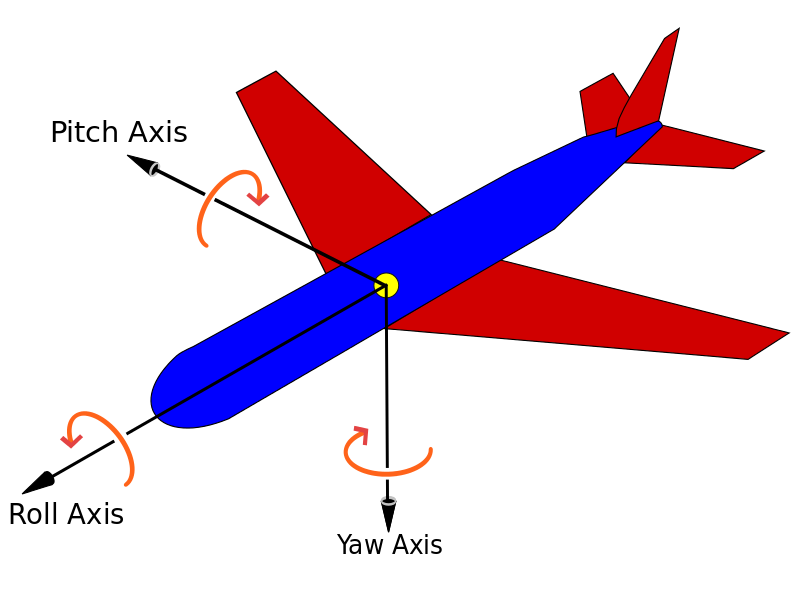

# First-person shooter profiles

The goal of this document is to help you figure out what FPS (first-person shooter) configurate works best for you at any given game here and give you the corresponding settings for any of the other games here.

Another goal is to promote you to use linear movements, such that linear movement of the mouse results in linear movements in game, thus promoting the muscle memory for <blank>. 

Computations and calculations...

## Terminology

lorem ipsum

* **CPI**: counts per inch, often erroneously referred to as DPI or dots per inch, is the number of steps the mouse will report when it moves one inch.
	* Strictly speaking, dots per inch or DPI refers to the density or resolution in which a printer can spray the color.
* **DPI**: dots per inch, often confused with **CPI**. It's how many dots per  inch an injet printer is capable of. 
* **Inch**: 1 inch is *exactly* 2.54 cm.
* **Physical Sensitivity**: lorem ipsum
* **Roll, pitch and yaw**:  [2]
	* When you're playing a first person shooter then **yaw** is what you get when you move your mouse sideways, and **pitch** is what you get when you move your mouse back and forth.  The buttons **Q** and **E** or often responsible for toggling the **roll** part.
* **Turn Circumference**: Expressed in centimeters per revolution (cm/rev). The length of a full rotation, i.e. the distance you need to move your mouse in order to complete a full rotation.  Might differ for the **pitch** axis and **yaw** axis.  
* **Curvative**: measured in **deg/mm** (degrees per millimeter) or **MPI** (minute per inch)
	* If you know the turn circumference TurnCircumference (measured in cm), Curvature = 360 / (10 * TurnCircumference) = 36 / TurnCircumference

## Games

lorem ipsum

### Counter-Strike: Global Offensive

lorem ipsum

* `TurnCircumference_HF` = `360` / (`CPI` * `sensitivity` * `m_yaw`)

If I want to use

 32 = 360 / (600 * `sensitivity` * 0.022)

sensitivity = 360 / (600 * 32 * 0.022)

#### In-game settings

* **Reverse Mouse** (`m_pitch`)
	* Inverts the movement of the Y axis.
		* Setting this off sets `m_ptich` to 0.022 (in degrees per increment).
		* Setting this on sets `m_pitch` to -0.022 (in degrees per increment).
* **Mouse Sensitivity** (`sensitivity`)
	* The main sensitivity multiplier.
* **Zoom Sensitivity** (`zoom_sensitivity_ratio_mouse`)
	* A naïve ratio caclulated by dividing by 90 the nominal FOVs (measured at 4:3 with) of a scoped weapon. Sensitivity is (incorrectly) scaled by this factor at each zoom steps.
* **Raw Input** (`m_rawinput`)
	* Ignore OS's effect on mouse input.
* **Mouse Acceleration** (`m_customaccel`)
	* Sets the mouse acceleration.
* **Acceleration Exponent** (`m_customaccel_exponent`)
	* Exponent of mouse acceleration. A value of `1` applies no acceleration.
* **Acceleration Prefactor** (`m_customaccel_scale`)
	* Scaling coefficient of the acceleration function.
* **Acceleration Cap** (`m_customaccel_max`)
	* Limits how much the sensitivity value can be increase by the acceleration algorithms.

### Rainbow Six Siege

I suspect the correct equation is,

(hip fire)

* TurnCircumference_HF = 2.54 * (100 * 100 * 2 * PI) / (CPI * MouseAxisSensitivity * MouseSensitivity * MouseSensitivityMultiplierUnit)

Curvature_HF = 36 / TurnCircumference_HF

where TurnCircumference is measured in cm per revolution.

(aim down sights)

TurnCircumference_ADS = ????

XFactorAiming * AimDownSightsMouse

I think optic multiplier is the zoom level (1x, 2x, and etc.)
Hipfire Mouse Delta * Optic Multiplier * Slider Multiplier

I suspect with

* MouseYawSensitivity = 100
* MousePitchSensitivity = 100
* MouseSensitivity = 50
* MouseSensitivityMultiplierUnit = 0.020000
* XFactorAiming = 0.020000
* AimDownSightsMouse = 100

when you move your mouse 1 inch horizontally you will complete a full rotation.

So the **Turn Circumference**, or **TC** will be 2.54 cm.

Here, assuming raw input is on and look inversion off.

HORIZONTAL

`MouseYawSensitivity`

VERTICAL 

`MousePitchSensitivity`

#### In-game sensitivity

MouseAxisSensitivity is either MouseYawSensitivity or MousePitchSensitivity

* **Raw Input - Mouse / Keyboard** (`RawInputMouseKeyboard`)
	* 0: raw input off
	* 1: raw input on
* **Mouse Look Inversion** (`InvertMouseAxisY`)
* **Mouse Sensitivity Horizontal** (`MouseYawSensitivity`)
	* Values from 1 - 100
* **Mouse Sensitivity Vertical** (`MousePitchSensitivity`)
	* Values from 1 - 100
* **Aim Down Sights** (`AimDownSightsMouse`)
	* Values from 1 - 100
* `MouseSensitivity`
	* Values from 1 - 100
	* Default value: 50
* `MouseSensitivityMultiplierUnit`
	* Values from 0.000001 - 1.000000 (or beyond)
	* Default value: 0.020000
* `XFactorAiming`
    * Values from 0.000001 - 1.000000 (or beyond)
	* Default value: 0.020000

## Sources

* [1] <https://liquipedia.net/counterstrike/Mouse_settings>
* [2] <https://upload.wikimedia.org/wikipedia/commons/thumb/c/c1/Yaw_Axis_Corrected.svg/798px-Yaw_Axis_Corrected.svg.png>
* [3] <https://www.reddit.com/r/Rainbow6/comments/3vl3yn/calculating_your_exact_mouse_sensitivities/>

